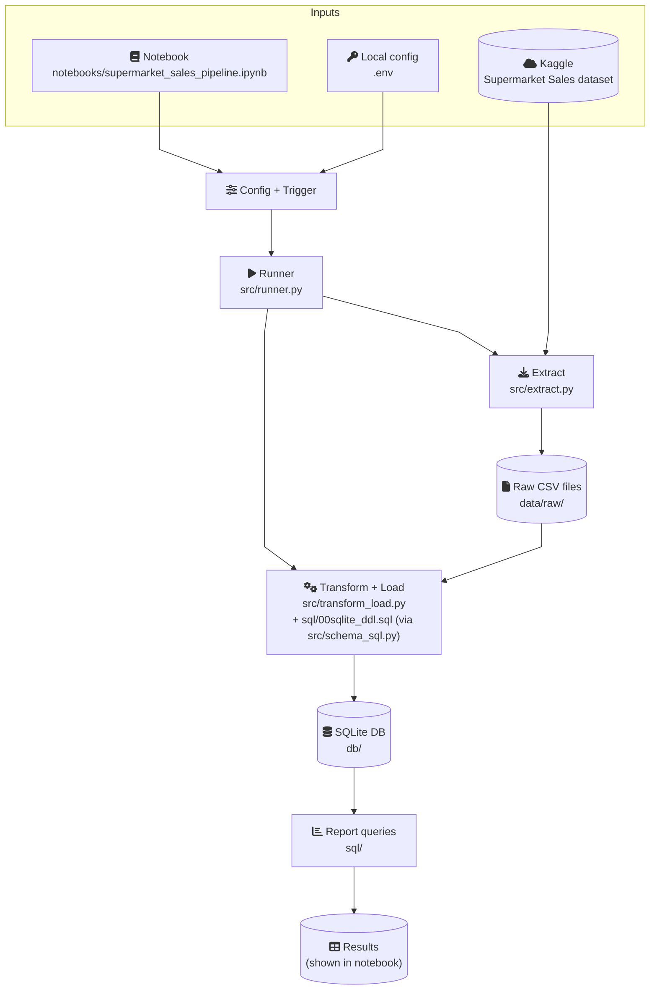

https://app.diagrams.net/?src=about#G1kQ_78EoLbHQdXhzcdg85Tl2lp9uoxOGn#%7B%22pageId%22%3A%22BOMhwzVbzcYY6AYEg-hv%22%7D

# GCP Migration Knowledge Base — Batch Data Pipeline & Reporting

This knowledge base article describes a production-ready GCP architecture for a batch analytics pipeline and provides a practical approach for migrating the current local pattern into GCP.

---

## 1) Architecture (production target)

### 1.1 End-to-end flow

```
External Source
   ↓
Orchestration
   ↓
Processing (ETL)
   ↓
Raw Storage (Bronze)
   ↓
Curated Warehouse (Silver)
   ↓
Analytics Layer (Gold)
   ↓
Reporting & BI
```

### 1.2 GCP project boundary (what must exist)

In production, the platform runs inside a dedicated GCP project with a private networking baseline, encryption controls, and audit logging enabled.

```
GCP Project (Production)
-------------------------------------------------
VPC Network
  - Private Subnet
  - Private Google Access
  - Firewall Rules
  - Cloud NAT (if needed)

Encryption:
  - CMEK (Customer Managed Keys)
  - Encryption at rest & in transit

Audit Logging Enabled
-------------------------------------------------
```

Notes (kept intentionally high-level for presentations):
- Private networking, encryption, and audit logging are treated as mandatory prerequisites; detailed network design is client/environment-specific.

---

## 2) Services and responsibilities (by layer)

### 2.1 External sources

Typical sources include partner APIs (e.g., Kaggle), ERP, and CRM systems.

Minimum expectations:
- Data is accessed over HTTPS.
- Credentials and tokens are stored in Secret Manager.

### 2.2 Orchestration — Cloud Composer (Managed Airflow)

Cloud Composer is responsible for:
- Scheduling the batch pipeline (DAGs)
- Handling retries, SLAs, and dependency ordering
- Triggering Dataflow jobs and capturing job state
- Integrating failure notifications

Reference trigger flow:

```
Cloud Composer → triggers Dataflow
```

### 2.3 Secrets — Secret Manager

Secret Manager stores API keys and service credentials.

Reference access pattern:

```
Composer/Dataflow → Secret Manager → Fetch Credentials
```

### 2.4 Processing — Cloud Dataflow (Apache Beam)

Dataflow executes the batch ETL:
1) Extract using secure credentials
2) Land raw data into Bronze
3) Transform and standardize
4) Load curated data into Silver

Operational expectations:
- Batch execution with autoscaling where appropriate
- Template-based deployability (Flex Templates) in CI/CD
- Private worker configuration aligned to the project boundary

### 2.5 Storage and warehouse layers

Bronze (raw landing): Cloud Storage
- Stores raw ingested files as the traceable landing zone
- Uses bucket-level access controls and lifecycle/retention policies as required

Silver (curated): BigQuery curated datasets
- Houses cleaned, conformed, query-friendly tables
- Uses dimensional modeling when appropriate (facts/dimensions)

Gold (analytics): BigQuery analytics datasets
- Houses business-ready aggregates/materialized views
- Optimized for BI and interactive analytics

Reference mapping:

```
Raw Data → Google Cloud Storage
```

### 2.6 Consumption layer

Typical consumers include Looker Studio, Power BI, Tableau, and SQL analysts.

Access is typically implemented via:
- IAM-authenticated users/groups
- Authorized views and service accounts for BI tools

Reference handoff:

```
Gold Dataset → Reporting Layer
```

---

## 3) Security and access model

This section is intentionally concise; controls are expected, but implementation details vary by client.

### 3.1 Service accounts (typical)

- Composer service account
- Dataflow worker service account
- BigQuery access service account
- CI/CD service account

### 3.2 IAM (least privilege)

The access model typically includes:
- Project-level IAM for platform administration
- Dataset/table-level IAM for data access boundaries
- Optional row-level and column-level security for sensitive data
- Optional policy tags for governed datasets

### 3.3 Network, encryption, and auditability (single-line expectations)

- Networking: private subnets, controlled egress, and service access patterns aligned to enterprise policies.
- Encryption: encryption in transit and at rest; CMEK where required.
- Auditability: audit logs enabled and monitored.

Optional (enterprise):
- VPC Service Controls for additional data exfiltration protection.

---

## 4) Observability (operations readiness)

### 4.1 Logging

Cloud Logging is expected to collect logs from:
- Cloud Composer
- Cloud Dataflow
- BigQuery
- Secret Manager
- IAM changes

### 4.2 Monitoring and alerting

Cloud Monitoring is expected to track:
- DAG/job success/failure and runtime
- Dataflow worker health and throughput signals
- BigQuery utilization/cost indicators
- Storage and pipeline KPIs

Alerting is expected for:
- Pipeline failures and SLA breaches
- Cost thresholds
- Repeated transient failures (to avoid silent degradation)

---

## 5) Governance and metadata

Dataplex / Data Catalog is typically used for:
- Metadata discovery and ownership
- Lineage visibility
- Classification and policy tags

Reference flow:

```
BigQuery & GCS → Dataplex → Governance Layer
```

---

## 6) Delivery model (CI/CD and environments)

Delivery is typically automated using:

```
GitHub
   ↓
Cloud Build
   ↓
Artifact Registry
   ↓
Deploy:
   - Dataflow Flex Template
   - Composer DAG
   - Terraform (Infrastructure as Code)
```

Environments:

```
Dev → QA → Prod
```

Environment separation typically includes:
- Separate GCP projects
- Separate Composer environments
- Separate BigQuery datasets and access boundaries
- Separate service accounts and secrets

---

## 7) Migration approach (how to take it forward)

This section is designed to be used as a client walkthrough.

### Phase 0 — Foundation

- Establish the GCP project boundary (VPC baseline, encryption posture, audit logging, IAM model).
- Define datasets/buckets naming conventions and environment separation.

### Phase 1 — Ingestion and Bronze

- Implement ingestion into Cloud Storage (Bronze) with consistent file naming, retention, and traceability.
- Ensure credentials are pulled only from Secret Manager and access is least-privilege.

### Phase 2 — Transform and Silver

- Implement transformation in Dataflow (Beam), loading curated tables into BigQuery Silver.
- Validate schema contracts and add data quality checks (coverage, uniqueness, ranges).

### Phase 3 — Gold and reporting

- Implement Gold aggregates/materialized views.
- Integrate BI tools via authorized views/service accounts.

### Phase 4 — Operate and harden

- Add monitoring/alerting for pipeline SLOs and cost.
- Add governance metadata and lineage.
- Operationalize CI/CD promotion (Dev → QA → Prod).

---

## 8) Local development reference (kept)

The local repository demonstrates the same conceptual flow (extract → transform/load → report) using a notebook and SQLite. This reference is useful for explaining the pattern before introducing managed GCP services.

### Local architecture diagram


