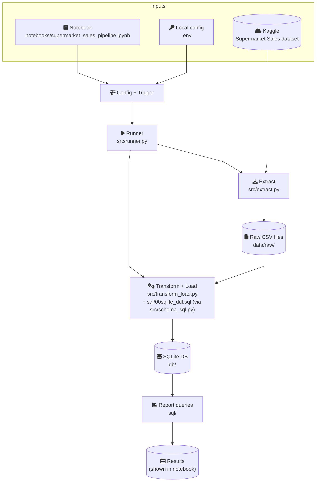

# Mermaid Architecture Diagram

```mermaid
%%{init: {"flowchart": {"curve": "linear", "nodeSpacing": 60, "rankSpacing": 70}} }%%
flowchart TD
  %% Local (dev) pipeline architecture (simplified + aligned)

  subgraph IN[Inputs]
    direction TB
    NB["fa:fa-book Notebook<br/>notebooks/supermarket_sales_pipeline.ipynb"]
    ENV["fa:fa-key Local config<br/>.env"]
    SRC[("fa:fa-cloud Kaggle<br/>Supermarket Sales dataset")]
  end

  TRG["fa:fa-sliders Config + Trigger"]

  RUN["fa:fa-play Runner<br/>src/runner.py"]
  EXT["fa:fa-download Extract<br/>src/extract.py"]
  RAW[("fa:fa-file Raw CSV files<br/>data/raw/")]
  MODEL["fa:fa-cogs Transform + Load<br/>src/transform_load.py<br/>+ sql/00sqlite_ddl.sql (via src/schema_sql.py)"]
  DB[("fa:fa-database SQLite DB<br/>db/")]
  RPT["fa:fa-chart-bar Report queries<br/>sql/"]
  OUT[("fa:fa-table Results<br/>(shown in notebook)")]

  NB --> TRG --> RUN
  ENV --> TRG
  RUN --> EXT
  SRC --> EXT
  EXT --> RAW
  RAW --> MODEL
  RUN --> MODEL
  MODEL --> DB
  DB --> RPT
  RPT --> OUT
```
